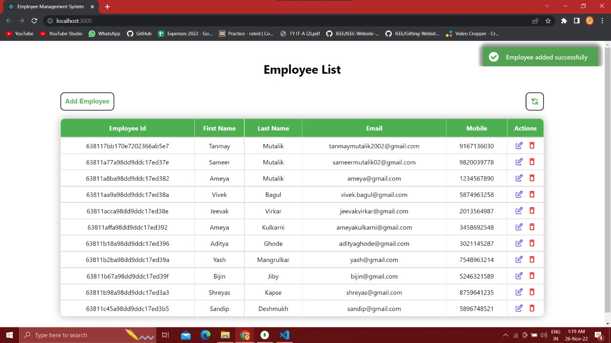
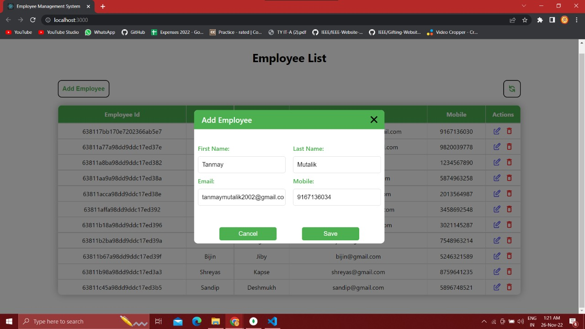
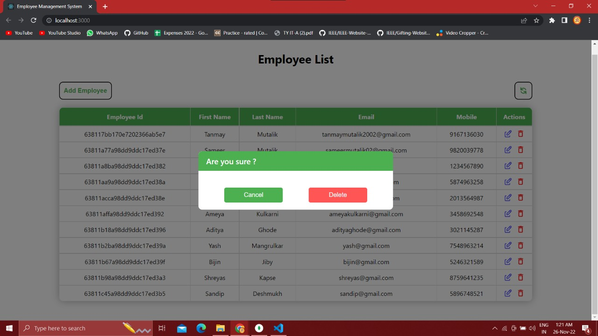

# Employee Management System (MERN)
----

**Stack**: MERN Stack

**Database**: MongoDB

**State Management**: Redux

**Backend**: node, express

----

    The system follows 3-Tier architecture where the frontend is made using ReactJS and the global state is
    managed by redux. Backend server is made in Node.js and express and the database is MongoDB.
----

    Connectivity between backend and database is achieved by mongoose library, whereas connectivity between backend and server is achieved by axios library.
----
    React uses all functional components and hooks like useState, useEffect, useRef. Use of pure css can be found in the frontend. 
    Use of two libraries:
        1. react-icons
        2. react-notifications

*System includes all the CRUD functionalities for
employee data.*

-----

## UI:

###### View:

###### Create:
 

###### Update:

###### Delete:

